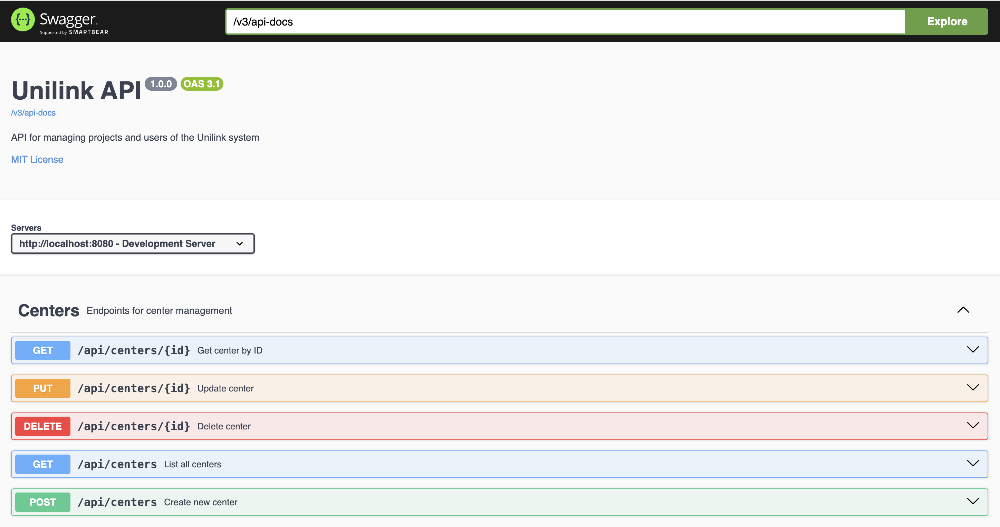
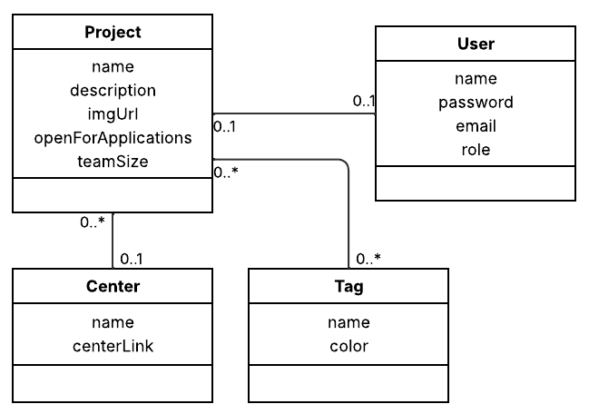

<h1 align="center" style="font-weight: bold;">UniLink 💻</h1>

<p align="center">
 <a href="#tech">Technologies</a> • 
 <a href="#structure">Folders structure</a> • 
 <a href="#started">Getting Started</a> • 
 <a href="#routes">API Endpoints</a> •
 <a href="#uml">UML Class</a> •
 <a href="#user_roles">User roles</a> •
 <a href="#colab">Collaborators</a>
</p>

<p align="center">
    <b>This repo contains the backend of UniLink, a plataform that provides a centralized, simple, and intuitive view of all extracurricular projects offered by a university. <a href="https://github.com/raphaelitos/unilink-frontend">Here</a> is the frontend repo.</b>
</p>

<h2 id="technologies">💻 Technologies</h2>

- **Framework Backend**: Spring Boot - Java 17
- **Database**: Postgres
- **Image Storage**: R2 bucket
- **Building**: Maven
- **Tests**: JUnit e Mockito
- **Authentication**: JWT
- **Version control**: Git/Github
- **Virtualization**: Docker
- **Documentation**: Swagger

<h2 id="structure">📂 Folders structure</h2>

```
src/main/java/com/unilink/api/
  ├── UnilinkApiApplication.java
  ├── config/
  ├── controller/
  ├── dtos/
  ├── enums/
  ├── exception/
  ├── model/
  ├── repository/
      ├── filters/
      └── specifications/
  ├── security/
  ├── seed/
  └── service/
```

<h2 id="started">🚀 Getting started</h2>

Here you describe how to run your project locally

<h3>Cloning</h3>

```bash
git clone https://github.com/joaoloss/unilink-backend.git
cd unilink-backend/api/
```

<h3>Config .env variables</h2>

Create your configuration file `.env` inside the api folder with the following information:

```
DB_HOST=<db address>
DB_PORT=<db port>
DB_NAME=<db name>
DB_USER=<db user>
DB_PASSWORD=<db password>
R2_ACCOUNT_ID=<r2 account id>
R2_ACCESS_KEY_ID=<r2 access key id>
R2_SECRET_ACCESS_KEY=<r2 secret access key>
```

<h3>Starting without docker</h3>

How to start your project

```bash
./mvnw spring-boot:run
```

<h3>Starting with docker</h3>

1. Build the image:

```bash
docker build -t unilink-api:1.0 .
```

2. Run the image:

```bash
docker run --env-file .env -p 8080:8080 unilink-api:1.0
```

<h2 id="routes">📍 API Endpoints</h2>
​
To view a detailed description of the API endpoints, start the application and open the following URL in your browser to access the Swagger documentation.

```
http://localhost:8080/swagger-ui.html
```

<p align="center">
  
</p>

<h2 id="uml">⚙️ UML Class</h2>

Below is a basic, non-exhaustive representation of the UML class.

<p align="center">
  
</p>

<h2 id="user_roles">User roles</h2>

<h3>SUPER_ADMIN</h3>

- Full system access (unrestricted).
- When the database is initialized and empty, a **default Super Admin** account is automatically created:
  - **Username:** `superAdmin`
  - **Email:** `super.admin@dev.com`
  - **Password:** `admin123!`

<h3>PROJECT_ADMIN</h3>

- Restricted access, limited to their assigned project.
- Permissions:
  - ✅ Can edit their own project.  
  - ❌ Cannot create new centers.  
  - ❌ Cannot create new users.  

<h2 id="colab">🤝 Collaborators</h2>

<p align="center">
 <a href="https://github.com/ConradoAntoniazi">Conrado Antoniazi</a> • 
 <a href="https://github.com/joaoloss">João Loss</a> • 
  <a href="https://github.com/raphaelitos">Raphael Dornelas</a>
</p>
